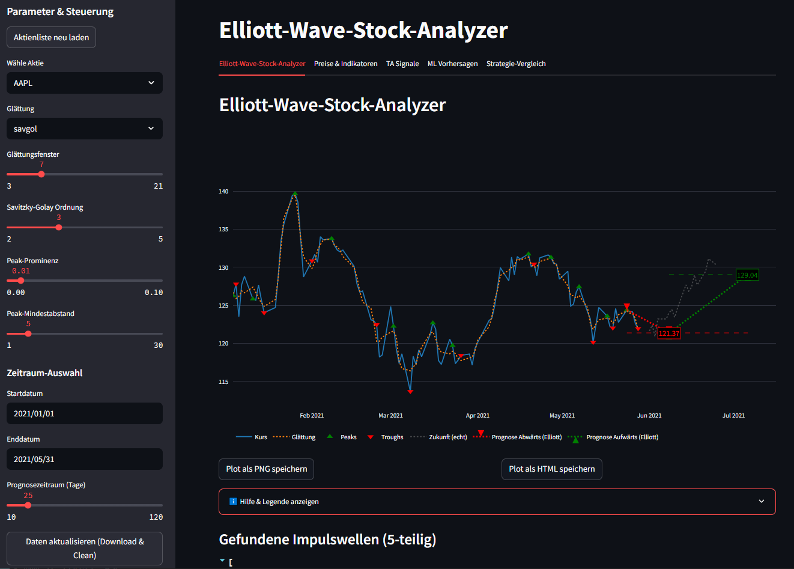
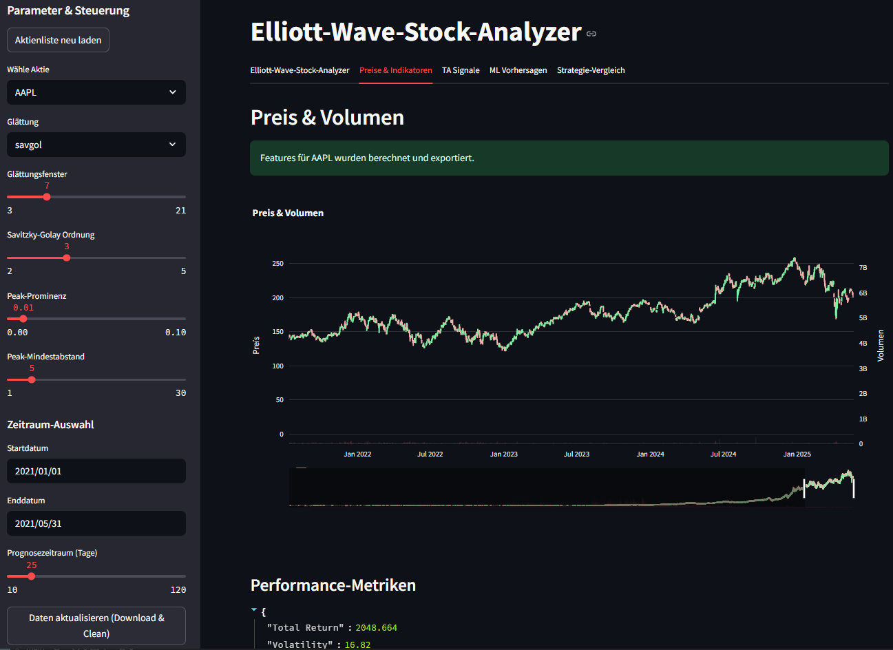
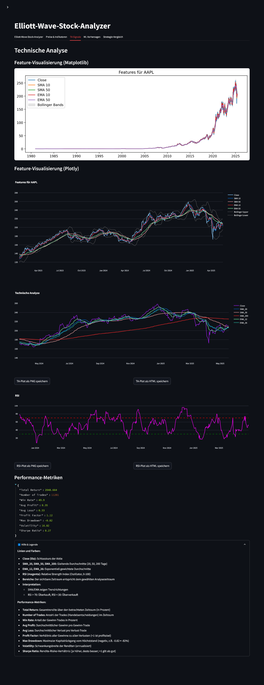
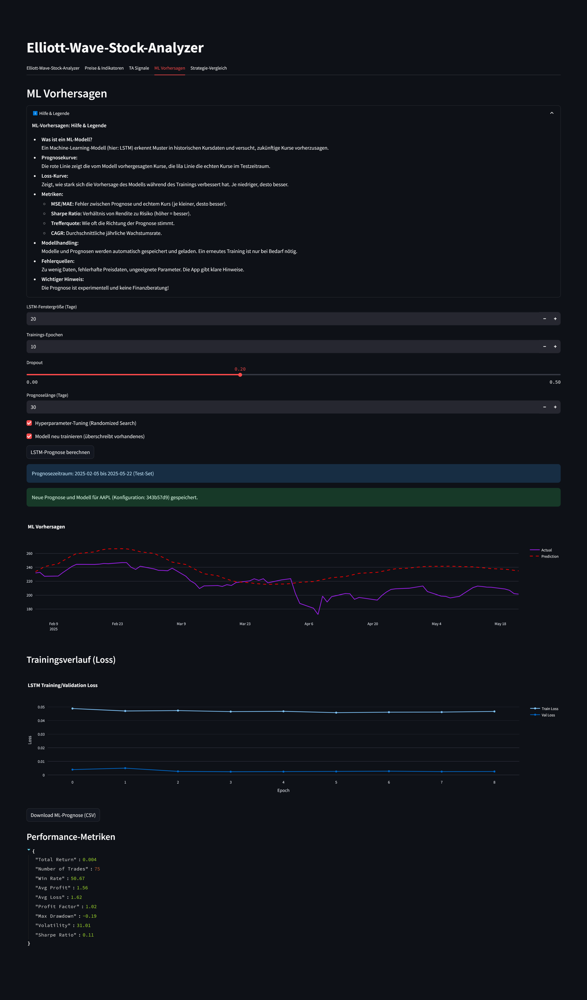
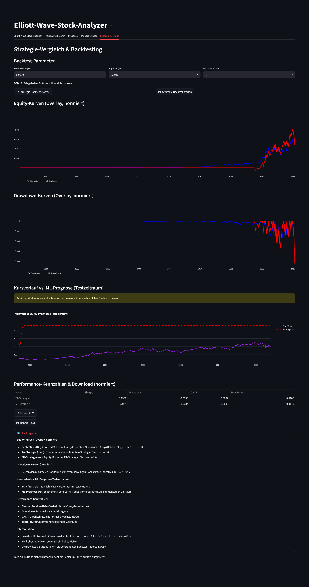

# Elliott-Wave-Stock-Analyzer

## Projektbeschreibung

Dieses Projekt entwickelt ein robustes, automatisiertes System zur Analyse und Visualisierung von Elliott-Wellen in echten Aktienkursdaten (Yahoo Finance).  
Das Ziel: Analysten und Unternehmen erhalten verständliche, nachvollziehbare und reproduzierbare Wellenanalysen als Basis für Investment-Entscheidungen.  
Alle Abläufe und Dokumentationen werden ausschließlich mit Markdown geführt.  
Die Implementierung ist vollständig modular, testgetrieben und für spätere ML-Erweiterungen vorbereitet.

---

## Projekt Bilder











---


### Funktionsweise
1. Echte Yahoo-Finance-Daten werden geladen und bereinigt.
2. Die Zeitreihe wird geglättet ("ma" oder "savgol").
3. Peaks und Troughs werden erkannt.
4. Die Elliott-Wellen werden heuristisch gezählt.
5. Prognosepfeile werden auf Basis der letzten echten Wellen berechnet.
6. Die echte Kursentwicklung nach dem Enddatum wird als Vergleich angezeigt.

### Hinweise
- Die Prognose ist keine Finanzberatung, sondern eine algorithmische Projektion nach Elliott-Heuristik.
- Alle Daten sind original von Yahoo Finance.
- Die App bietet einen Export als PNG und HTML direkt aus der Oberfläche.
- Über die Hilfe/Legende in der App erhältst du jederzeit eine Übersicht aller Funktionen und Begriffe.


 ### Projektstand:
- Elliott-Wellen-Analyse, TA, ML-Vorhersage und Backtesting sind voll funktionsfähig und robust.
- Die ML-Pipeline ist wissenschaftlich fundiert, fehlertolerant und für produktiven Einsatz geeignet.
- TA- und ML-Strategien können im Overlay direkt verglichen werden (Equity, Drawdown, Metriken, Download-Reports).
- Backtesting-Reports werden als CSV/HTML exportiert (backtest/reports/).
- Feature-Engineering, TA-Export und Visualisierung sind integriert.
- Die Buy&Hold-Kurve wurde aus dem Strategie-Vergleich entfernt (nur noch TA/ML-Vergleich).
- Alle relevanten Tests (ML, Feature Engineering, Backtest) laufen fehlerfrei.
- Weitere Features (Feature-Engineering, Klassifikation, automatische Parameterempfehlung) können einfach ergänzt werden.

## Installation & Ausführung

Das Projekt ist auf GitHub verfügbar: [https://github.com/Sebastian-Gasior/NextTick8](https://github.com/Sebastian-Gasior/NextTick8)

### Voraussetzungen
- Python 3.9+
- [uv](https://github.com/astral-sh/uv) (für schnelle, moderne Python-Umgebungen)
- Git

### Schritt-für-Schritt-Anleitung

```bash
# 1. Repository klonen
 git clone https://github.com/Sebastian-Gasior/NextTick8.git
 cd NextTick8

# 2. Virtuelle Umgebung mit uv erstellen
 uv venv

# 3. Abhängigkeiten installieren
 uv pip install -r requirements.txt

# 4. App starten
 streamlit run app.py
```

Die App ist dann unter http://localhost:8501 erreichbar.

### requirements.txt – Modulübersicht

**Daten & Analyse:**
- `yfinance` – Download von Aktienkursen direkt von Yahoo Finance
- `pandas` – Datenmanipulation und -analyse
- `numpy` – Numerische Berechnungen, Arrays
- `scipy` – Signalverarbeitung, Peak-Detection, Statistik

**Visualisierung:**
- `streamlit` – Interaktive Web-App und GUI
- `matplotlib` – Plotting (intern für einige Analysen)
- `plotly` – Interaktive Visualisierung der Kursdaten und Prognosen

**Machine Learning & Statistik:**
- `scikit-learn` – (Vorbereitet) für spätere ML-Modelle, z.B. Klassifikation, Regression
- `keras`, `tensorflow` – Für LSTM-Modelle (werden im ML-Teil verwendet)

**Testing:**
- `pytest` – Test-Framework für Unittests und Integrationstests

**Utilities:**
- `pillow` – Bildverarbeitung (z.B. für PNG-Export)
- `python-dotenv` – Laden von Umgebungsvariablen aus .env-Dateien

## Troubleshooting & FAQ

### Häufige Fehler & Lösungen

- **Keine Daten angezeigt / Plot leer:**
  - Prüfe, ob die Daten für den gewählten Zeitraum und Ticker vorhanden sind.
  - Nutze ggf. "Daten aktualisieren" in der App.
  - Achte auf korrekte Schreibweise im stocks.txt.

- **Fehlermeldung beim Daten-Download:**
  - Internetverbindung prüfen.
  - Ticker ggf. nicht mehr bei Yahoo Finance verfügbar.

- **Prognose weicht stark vom echten Verlauf ab:**
  - Die Prognose basiert auf heuristischen Elliott-Wellen und ist keine exakte Vorhersage.
  - Starke Marktbewegungen oder News können nicht abgebildet werden.

- **Export funktioniert nicht:**
  - Stelle sicher, dass der Ordner `data/exported/` existiert und beschreibbar ist.
  - Prüfe, ob alle Abhängigkeiten installiert sind (insb. pillow, plotly).

### FAQ

**Wie genau ist die Prognose?**
- Die Prognose ist eine algorithmische Projektion auf Basis der letzten echten Wellen. Sie dient der Visualisierung, nicht als Finanzberatung.

**Welche Daten werden verwendet?**
- Es werden ausschließlich echte Yahoo-Finance-Daten genutzt (über yfinance).

**Wie kann ich eigene Aktien hinzufügen?**
- Einfach den Ticker in die stocks.txt eintragen und "Daten aktualisieren" klicken.

**Was ist der Unterschied zwischen "ma" und "savgol"?**
- "ma": Gleitender Durchschnitt, robust, glättet stark.
- "savgol": Savitzky-Golay-Filter, erhält Peaks/Troughs besser, ideal für Elliott-Wellen.

**Wie kann ich die Visualisierung exportieren?**
- Über die Buttons "Plot als PNG/HTML speichern" in der App.

**Kann ich die App auf einem Server deployen?**
- Ja, z.B. mit Streamlit Cloud, netcup, oder jedem Server mit Python 3.9+ und uv.

**Wo finde ich die Backtesting-Reports?**
- Alle Backtesting-Reports (CSV/HTML) werden im Ordner `backtest/reports/` gespeichert und können direkt aus der App heruntergeladen werden.


## ML-Integration & Zeitreihenmodelle

### Überblick

- Das Projekt enthält eine **vollständige ML-Pipeline** für Zeitreihenprognosen und Backtests mit echten Aktienkursen.
- **Stand Mai 2025:**
    - **Robuste Datenvalidierung:** Vor jedem Training und nach jedem Split werden Preisdaten auf Nullen, negative Werte und NaN/Inf geprüft. Training findet nur mit validen Daten statt.
    - **Numerische Fehlerbehandlung:** Schutz vor Division durch 0 und ungültigen Werten in allen ML-Kernfunktionen. Fehler wie "divide by zero" werden proaktiv verhindert.
    - **Persistente Prognosen:** Prognosen, Modelle, Scaler und Logs werden eindeutig pro Ticker und Modellkonfiguration gespeichert und beim Start automatisch geladen.
    - **Hyperparameter-Tuning:** Randomized Search ist robust gegen fehlerhafte Parameter und bricht mit klarer Fehlermeldung ab, falls kein Modell trainiert werden kann.
    - **User-Feedback:** Jede Fehlerursache (z.B. zu wenig Daten, schlechte Parameter, fehlerhafte Preisdaten) wird klar im UI kommuniziert.
    - **Visualisierung:** Prognose und Loss-Kurve werden immer angezeigt, sofern valide. Performance-Metriken werden berechnet und angezeigt.
    - **Backtesting:** TA- und ML-Strategien können verglichen werden, inklusive Performance-Kennzahlen und Download-Optionen.
- Alle Modelle (insb. LSTM) werden ausschließlich auf validierten Kursdaten aus `data/cleaned/` trainiert und evaluiert.
- Die ML-Module sind in `src/ml/` gekapselt und modular aufgebaut:
    - `time_split.py`: Walk-Forward- und Out-of-Sample-Splits
    - `feature_engineering.py`: Technische Indikatoren (MA, RSI, ...)
    - `model_training.py`: LSTM-Training und Prognose (Keras/TensorFlow)
    - `backtest_simulation.py`: Backtesting von ML-Signalen
    - `metrics.py`: Sharpe, Drawdown, Hit Ratio
    - `plots.py`: Visualisierung von Equity und Prognosen
    - `allocation.py`: Portfolio-Gewichtung
    - `long_term_simulation.py`: Langfrist-Simulationen
- Alle ML-Tests liegen in `tests/ml/` und decken die gesamte Pipeline ab (inkl. End-to-End-Test).

---

### Troubleshooting (ML)

- **Fehler: "divide by zero encountered in scalar divide"**  
  → Die Preisdaten enthalten Nullen, negative Werte oder NaN. Bitte Datenbasis prüfen und ggf. neu laden.
- **Fehler: "Randomized Search: Kein valides Modell gefunden"**  
  → Zu wenig Daten, zu große Fenstergröße oder ungeeignete Hyperparameter. Bitte Parameter anpassen und Datenbasis prüfen.
- **Fehler: "Zu wenig Daten für die gewählte Fenstergröße"**  
  → Fenstergröße verkleinern oder mehr Daten verwenden.
- **Fehler: "Preisdaten enthalten NaN/negative Werte"**  
  → Datenbasis prüfen, ggf. Daten neu laden oder Ticker wechseln.

#### Empfohlene Vorgehensweise bei ML-Problemen
1. **Datenbasis prüfen:**  
   Mindestens 500 Börsentage, keine Nullen/NaN/negative Werte.
2. **Fenstergröße sinnvoll wählen:**  
   Nicht größer als 1/10 der Datenbasis.
3. **Dropout und Epochen moderat wählen:**  
   Dropout 0.1–0.3, Epochen 10–30.
4. **Fehlermeldungen beachten:**  
   Die App gibt immer einen klaren Hinweis, was zu tun ist.


## Mögliche zukünftige Erweiterungen

- **Portfolio-Backtesting:** Gleichzeitiges Backtesting mehrerer Aktien/Strategien, Portfolio-Optimierung, Risikomanagement.
- **Weitere ML-Modelle:** Integration von Transformer, Prophet, XGBoost oder anderen Zeitreihenmodellen.
- **Live-Daten & Alerts:** Automatisches Nachladen neuer Kurse, E-Mail/Push-Benachrichtigungen bei Signalen.
- **Order-Simulation:** Realistischere Handelsausführung (Limit/Stop-Orders, Orderbuch-Simulation, Gebührenmodelle).
- **Erweiterte Visualisierung:** Interaktive Heatmaps, Korrelationsmatrizen, Custom-Reports.
- **Fundamentaldaten:** Einbindung von Bilanz-, Gewinn- und Wirtschaftsdaten zur Modellverbesserung.
- **Automatisierte Hyperparameter-Optimierung:** Grid Search, Bayesian Optimization, AutoML.
- **Explainable AI:** Modellinterpretierbarkeit, Feature-Importances, Shapley-Werte.
- **Backtest-Visualisierung:** Interaktive Trade-Logs, Trade-by-Trade-Analyse, animierte Equity-Kurven.


---