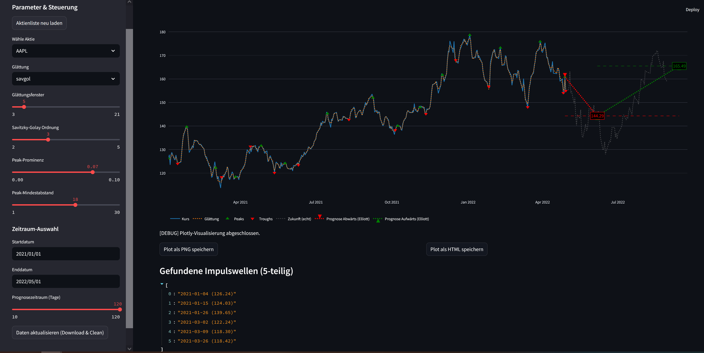

# Elliott-Wave-Stock-Analyzer

## Projektbeschreibung

Dieses Projekt entwickelt ein robustes, automatisiertes System zur Analyse und Visualisierung von Elliott-Wellen in echten Aktienkursdaten (Yahoo Finance).  
Das Ziel: Analysten und Unternehmen erhalten verständliche, nachvollziehbare und reproduzierbare Wellenanalysen als Basis für Investment-Entscheidungen.  
Alle Abläufe und Dokumentationen werden ausschließlich mit Markdown geführt.  
Die Implementierung ist vollständig modular, testgetrieben und für spätere ML-Erweiterungen vorbereitet.

---

## Projekt Bilder




---

## Legende & Hilfe

### Legende
- **Kurs:** Originaler Schlusskurs der Aktie (blaue Linie)
- **Glättung:**
  - **ma**: Moving Average (gleitender Durchschnitt)
  - **savgol**: Savitzky-Golay-Filter (polynomiale Glättung)
- **Peaks:** Lokale Hochpunkte (grüne Dreiecke)
- **Troughs:** Lokale Tiefpunkte (rote Dreiecke)
- **Zukunft (echt):** Tatsächlicher Kursverlauf nach dem gewählten Enddatum (graue Linie)
- **Prognose Abwärts (Elliott):** Roter Pfeil – prognostizierte Korrekturwelle gemäß Elliott-Logik
- **Prognose Aufwärts (Elliott):** Grüner Pfeil – prognostizierte Erholungswelle gemäß Elliott-Logik

### Parameter
- **Glättungsfenster:** Größe des Fensters für die Glättung (Anzahl Tage)
- **Savitzky-Golay Ordnung:** Grad des Polynoms für Savitzky-Golay
- **Peak-Prominenz:** Mindesthöhe, damit ein Peak erkannt wird
- **Peak-Mindestabstand:** Mindestabstand zwischen Peaks
- **Start-/Enddatum:** Zeitraum für die Analyse
- **Prognosezeitraum:** Länge der Prognose in Tagen

### Funktionsweise
1. Echte Yahoo-Finance-Daten werden geladen und bereinigt.
2. Die Zeitreihe wird geglättet ("ma" oder "savgol").
3. Peaks und Troughs werden erkannt.
4. Die Elliott-Wellen werden heuristisch gezählt.
5. Prognosepfeile werden auf Basis der letzten echten Wellen berechnet.
6. Die echte Kursentwicklung nach dem Enddatum wird als Vergleich angezeigt.

### Hinweise
- Die Prognose ist keine Finanzberatung, sondern eine algorithmische Projektion nach Elliott-Heuristik.
- Alle Daten sind original von Yahoo Finance.
- Die App bietet einen Export als PNG und HTML direkt aus der Oberfläche.
- Über die Hilfe/Legende in der App erhältst du jederzeit eine Übersicht aller Funktionen und Begriffe.

## Projektstand (Phase 7 abgeschlossen)

- Export & Sharing (PNG/HTML) integriert
- Nutzerführung und Hilfebereich in der App
- Alle bisherigen Features und Tests lauffähig

**Nächste Phase:**
Test, Stabilisierung & Dokumentation (Phase 8)


## Installation & Ausführung

Das Projekt ist auf GitHub verfügbar: [https://github.com/Sebastian-Gasior/NextTick8](https://github.com/Sebastian-Gasior/NextTick8)

### Voraussetzungen
- Python 3.9+
- [uv](https://github.com/astral-sh/uv) (für schnelle, moderne Python-Umgebungen)
- Git

### Schritt-für-Schritt-Anleitung

```bash
# 1. Repository klonen
 git clone https://github.com/Sebastian-Gasior/NextTick8.git
 cd NextTick8

# 2. Virtuelle Umgebung mit uv erstellen
 uv venv

# 3. Abhängigkeiten installieren
 uv pip install -r requirements.txt

# 4. App starten
 streamlit run app.py
```

Die App ist dann unter http://localhost:8501 erreichbar.

### requirements.txt – Modulübersicht

**Daten & Analyse:**
- `yfinance` – Download von Aktienkursen direkt von Yahoo Finance
- `pandas` – Datenmanipulation und -analyse
- `numpy` – Numerische Berechnungen, Arrays
- `scipy` – Signalverarbeitung, Peak-Detection, Statistik

**Visualisierung:**
- `streamlit` – Interaktive Web-App und GUI
- `matplotlib` – Plotting (intern für einige Analysen)
- `plotly` – Interaktive Visualisierung der Kursdaten und Prognosen

**Machine Learning & Statistik:**
- `scikit-learn` – (Vorbereitet) für spätere ML-Modelle, z.B. Klassifikation, Regression

**Testing:**
- `pytest` – Test-Framework für Unittests und Integrationstests

**Utilities:**
- `pillow` – Bildverarbeitung (z.B. für PNG-Export)
- `python-dotenv` – Laden von Umgebungsvariablen aus .env-Dateien
